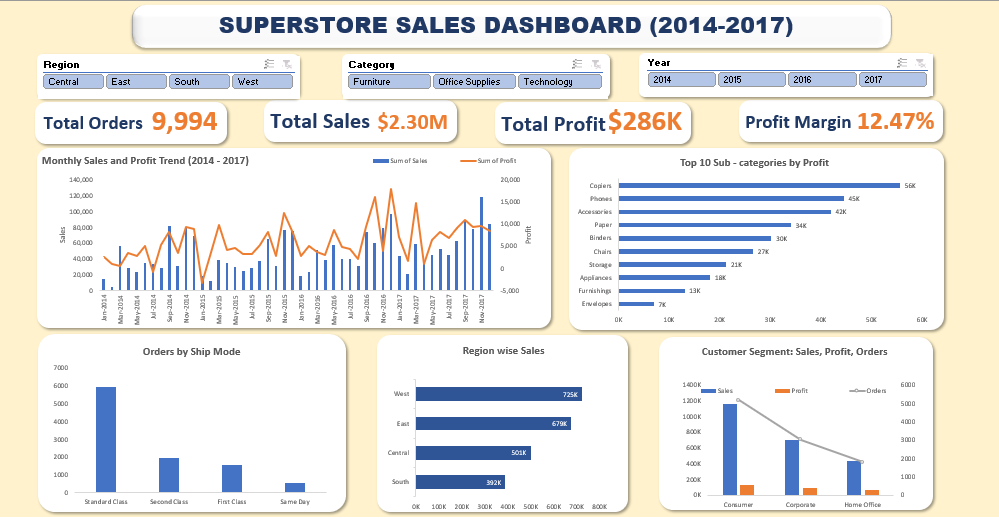
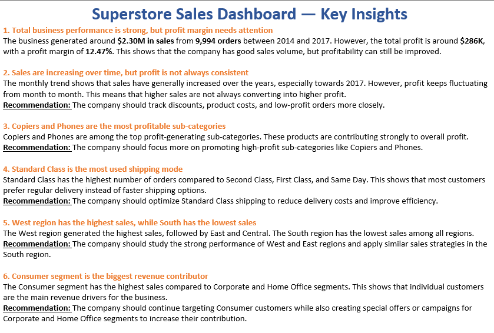

# superstore-excel-dashboard (Excel)
An interactive Excel dashboard analyzing sales, profit, orders, and customer segments using the Superstore dataset.

## Dashboard preview

## Insights Sheet

## Overview
Interactive Excel dashboard analysing **9,994 orders** from a US retail superstore 
across 4 years (2014–2017). Built to surface revenue trends, regional gaps, 
sub-category profitability, and shipping behaviour using Pivot Tables, Slicers, 
and Combo Charts.

---

## Business Questions Answered
- How have monthly sales and profit trended over 4 years?
- Which regions and sub-categories are most and least profitable?
- Which customer segment drives the most revenue and orders?
- How is order volume distributed across shipping modes?

---

## Key Findings

| # | Finding | Implication |
|---|---|---|
| 1 | 12.47% profit margin on $2.30M sales | Discounting or cost structure needs review |
| 2 | West leads sales at $725K; South at $392K | 2x regional gap — marketing opportunity |
| 3 | Copiers ($56K) are the top profit sub-category | High-margin products to prioritise |
| 4 | Consumer segment = 52% of all orders | Core audience to retain and grow |
| 5 | Standard Class = 60% of shipments | Logistics optimisation opportunity |
| 6 | Sales grew toward 2017; profit did not always follow | Discounting likely eroding margins |

---

## Dashboard Features
- **KPI strip** — Total Orders, Total Sales, Total Profit, Profit Margin %
- **Monthly Sales vs Profit Trend** — combo chart (bar + line), 2014–2017
- **Top 10 Sub-categories by Profit** — horizontal bar, sorted high to low
- **Region-wise Sales** — horizontal bar with data labels
- **Customer Segment Analysis** — grouped chart (Sales, Profit, Orders)
- **Orders by Ship Mode** — bar chart showing volume distribution
- **Interactive slicers** — Region, Category, Year (connected to all charts)

---

## Workbook Structure
| Sheet | Purpose |
|---|---|
| raw_data | Original unmodified dataset |
| clean_data | Cleaned and formatted data |
| Pivot | All pivot tables powering the dashboard |
| Dashboard | Interactive visual dashboard |
| Insights | Written business insights + recommendations |

---

## Dataset
**Source:** [Kaggle — Sample Superstore Dataset](https://www.kaggle.com/datasets/vivek468/superstore-dataset-final)  
9,994 rows · 21 columns · US retail · 2014–2017

## Tools Used
`Microsoft Excel` — Pivot Tables · Pivot Charts · Slicers · Combo Charts · KPI Cards

## How to Use
1. Download `Superstore_sales_dataset.xlsx`
2. Open in Microsoft Excel (2016 or later)
3. Go to the **Dashboard** tab
4. Use the Region / Category / Year slicers to filter all charts simultaneously
